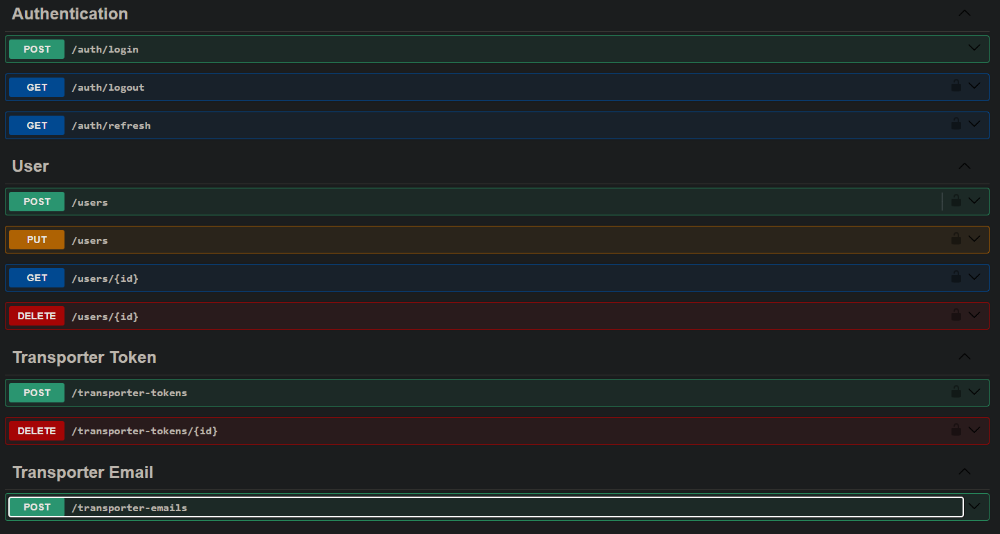
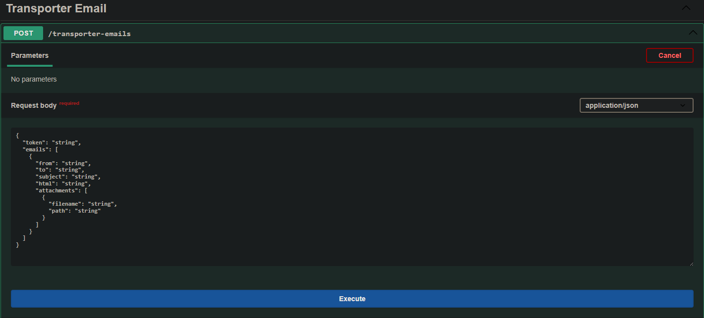

### Projeto de Microserviço de Envio de E-mails

#### Visão Geral

Este projeto é um MVP de um microserviço de envio de e-mails desenvolvido com o framework NestJS. O NestJS é um framework opinado que define um padrão semelhante ao C#, incluindo injeção de dependência e outras funcionalidades.

#### Funcionalidade

O microserviço funciona da seguinte maneira:

1. **Criação de Conta e Autenticação**: O usuário cria uma conta e realiza a autenticação utilizando um sistema de tokens (access token).
2. **Registro de Acesso**: O usuário registra seu acesso ao NodeMailer (biblioteca de envio de e-mails para JavaScript), fornecendo o endereço de e-mail e a senha, que são criptografados e armazenados no banco de dados.
3. **Geração de Token**: O microserviço retorna um token de longa duração que serve como identificador das informações cadastradas.
4. **Envio de E-mails**: Com o token, o usuário pode fazer uma requisição especificando o token de identificação e os e-mails a serem enviados. O microserviço descriptografa as informações internamente, envia os e-mails e retorna o número de e-mails enviados com sucesso e os que falharam.

#### Swagger

#### Swagger - Body de Envio de E-mails

#### Configuração e Execução

Para rodar o projeto:

1. Certifique-se de ter o npm instalado.
2. Abra o terminal na raiz do projeto e execute `npm install` para instalar todos os pacotes necessários.
3. Tenha o Docker rodando na sua máquina para iniciar o banco de dados. Execute o comando `npx prisma migrate dev` para migrar o banco de dados utilizando o Prisma.
4. Acesse `http://localhost:8080/docs` para acessar a documentação Swagger e realizar os testes necessários.

#### Estrutura do Projeto

A estrutura do projeto é inspirada no conceito de arquitetura limpa e inclui:

- **DTOs, Controllers, Models**: Particularidades do framework NestJS.
- **Use Cases, Repositories, Entidades**: Para a lógica de negócio.
- **Utilitários**: Funções padrão como classes de JWT, guards para permissões, pipes para tratamento de dados, filtros de exceção, classes para manipulação de datas em JavaScript, entre outros.

#### Gerenciamento do Banco de Dados

Toda a estrutura do banco de dados é gerenciada pelo arquivo `schema.prisma` localizado na pasta `prisma`, onde são feitos mapeamentos de entidades e relacionamentos.
